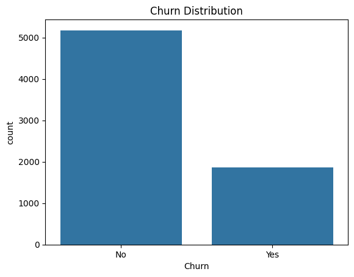
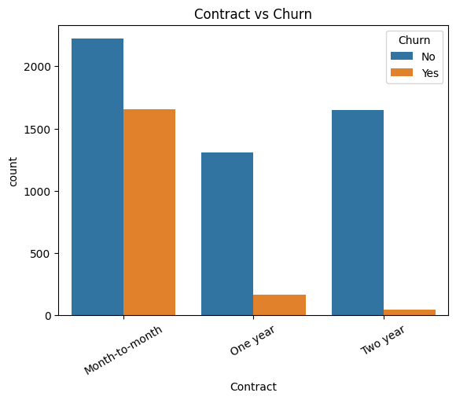
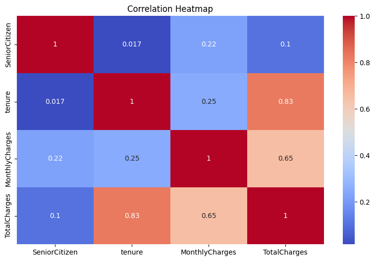
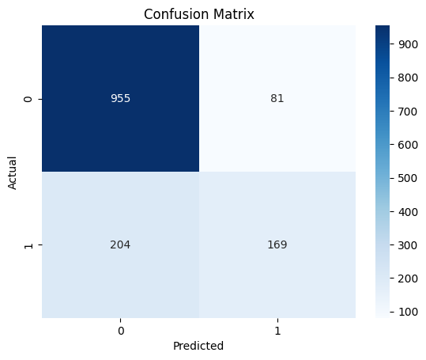
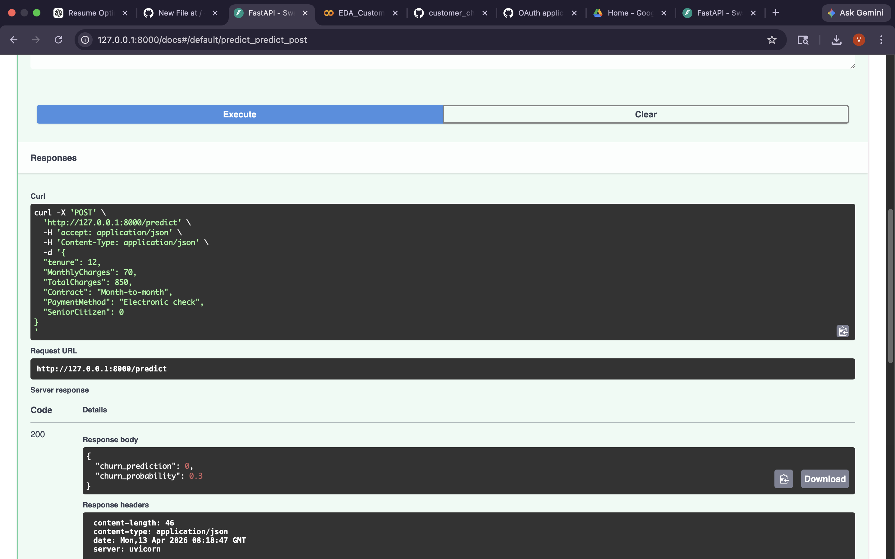

  # Customer Retention Intelligence System 🚀

An end-to-end Machine Learning system to predict customer churn using behavioral and billing data, deployed via a FastAPI-based real-time prediction service.

---

## 📌 Problem

Customer churn directly impacts revenue and growth in subscription-based businesses.  
This project predicts churn risk to help businesses take proactive retention actions.

---

## 💼 Impact

- Identify high-risk customers early  
- Enable proactive retention strategies  
- Support data-driven decision making  

---

## ⚙️ System Overview

Pipeline:  
Data → Preprocessing → EDA → Model → API → Prediction  

- Model: Random Forest  
- Deployment: FastAPI  
- Output: Churn prediction + probability  

---

## 📊 Key Insights

- Month-to-month contracts → highest churn  
- Higher monthly charges → higher churn risk  
- Longer tenure → more stable customers  
- Electronic check users → higher churn tendency  

---

## 📈 Visual Insights

  
  

---

## 🤖 Model Performance

- Accuracy: ~80–85%  
- ROC-AUC: ~0.82–0.88  

Top Features:
- Contract type  
- Monthly charges  
- Tenure  
- Payment method  

---

## 🚀 API (FastAPI)

Endpoint:  
POST /predict  

Sample Input:

    {
      "tenure": 12,
      "MonthlyCharges": 70,
      "TotalCharges": 850,
      "Contract": "Month-to-month",
      "PaymentMethod": "Electronic check",
      "SeniorCitizen": 0
    }

Sample Output:

    {
      "churn_prediction": 1,
      "churn_probability": 0.72
    }

Swagger UI:  
http://127.0.0.1:8000/docs  

---

## 📸 API Preview

---

## 🛠 Tech Stack

- Python, pandas, NumPy  
- scikit-learn  
- FastAPI, Uvicorn  
- Matplotlib, Seaborn, Plotly  

---

## ⚙️ Setup

    git clone https://github.com/vedmali15/customer-retention-ml-system.git
    cd customer-retention-ml-system/01_Customer_Retention_System
    pip install -r requirements.txt
    cd app
    uvicorn app:app --reload

Open in browser:  
http://127.0.0.1:8000/docs
